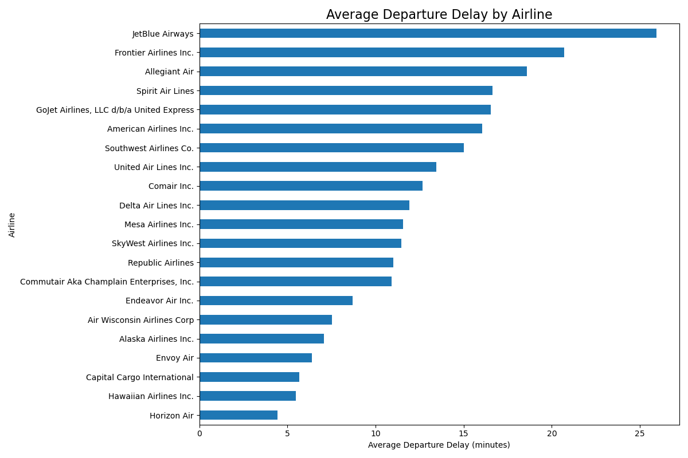
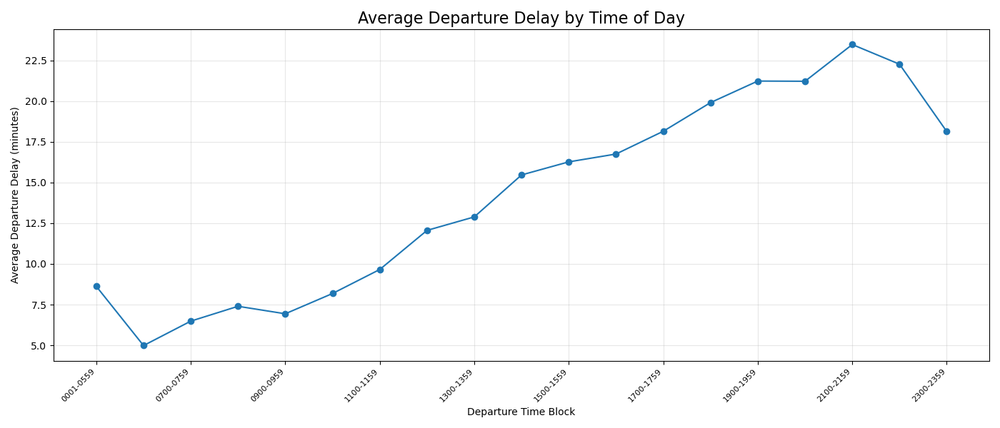
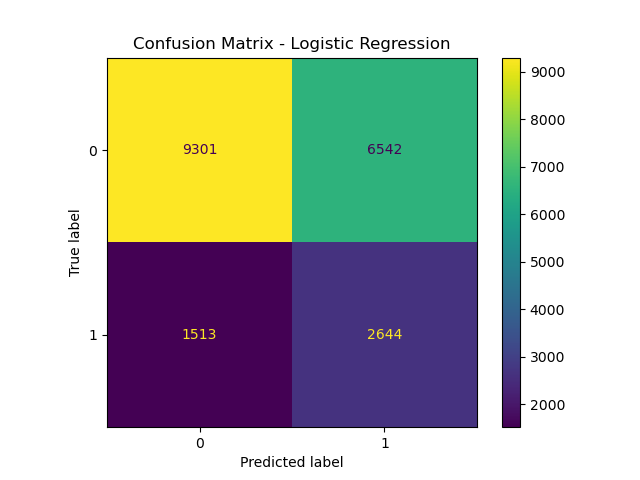

# Flight Delay Analysis

This is a data science project analyzing flight delay patterns using Python, pandas and some machine learning techniques.

## Goals
- Explore flight delay trends
- Identify factors and variables associated with delays
- Create visualizations of airline and airport performance
- Build predictive models for flight delays

## Tools Used
- Python
- pandas
- scikit
- Jupyter Notebook

## Dataset
Flight performance and delay data from Kaggle.

## Airline Delay Trends





## Project Structure

```text
flight-analysis/
│
├── data/
├── notebooks/
├── visuals/
├── flight_analysis.py
└── README.md